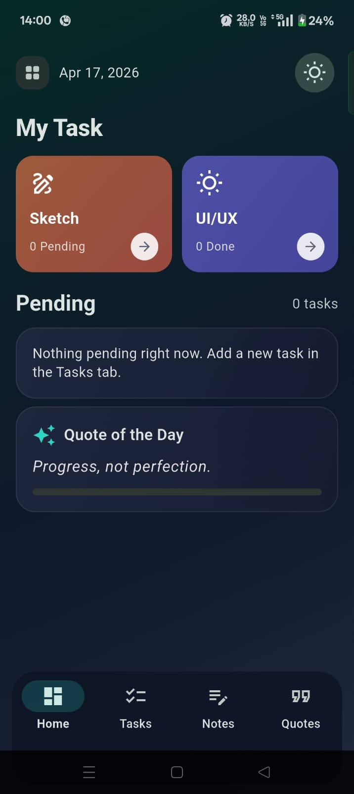
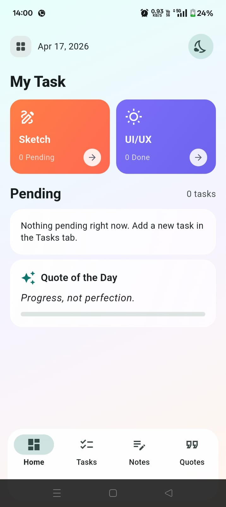
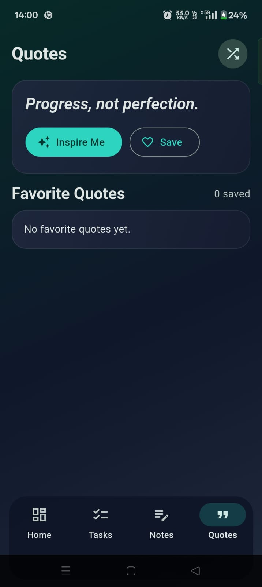
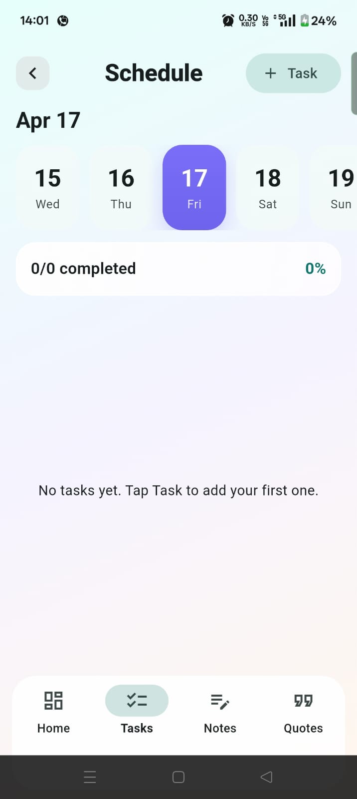

# Smart Personal Dashboard

A modern Flutter productivity app with a visually rich dashboard experience.

This project includes:
- A redesigned Home experience inspired by premium task app UI patterns
- Task planning with reminders and completion tracking
- Notes and journal entries
- Motivational quotes with favorites
- Persistent local storage using SharedPreferences
- Light and dark mode support

## Features

### Home
- Clean top header with date and theme toggle
- High-contrast feature cards for task focus
- Pending task preview cards
- Daily quote panel with progress indicator

### Tasks
- Schedule-style interface with day pills
- Timeline-inspired task cards
- Add, edit, complete, and delete task flows
- Optional task reminders

### Notes
- Create and delete journal-style entries
- Styled note list cards with clear visual hierarchy

### Quotes
- Shuffle through motivational quotes
- Save and manage favorite quotes

### Persistence
- Tasks, notes, selected quote index, and favorites are saved locally

## Tech Stack

- Flutter
- Dart
- shared_preferences

## Getting Started

### 1. Prerequisites

- Flutter SDK installed
- A configured device or emulator

Check setup:

	flutter doctor

### 2. Install Dependencies

	flutter pub get

### 3. Run the App

	flutter run

### 4. Analyze Code

	flutter analyze

## Project Structure

- lib/main.dart: App UI, state handling, persistence integration, and all screens
- pubspec.yaml: Dependencies and project metadata
- android, ios, web, linux, macos, windows: Platform-specific Flutter targets

## Screenshots

Add your screenshots to:

- assets/screenshots/

Suggested file names:

- home.jpeg
- tasks.jpeg
- notes.jpeg
- quotes.jpeg

### Home

### Tasks

### Notes

### Quotes

## Repository

GitHub: https://github.com/Eshan1901/myapp

## Future Improvements

- Add custom onboarding flow
- Add categories and tags for tasks and notes
- Add cloud sync and authentication
- Add widget tests and integration tests

## License

This project is currently unlicensed. Add a LICENSE file if you want to define usage terms.
